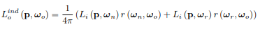

**REPORT LAB 2**

**Advanced Visualization**

**Task 1 → Implement the Mirror material**

To implement this task we created a new class called **Mirror** which inherits from the Material class. In this class, we implemented the inherited methods (**hasSpecular, hasTransmission and hasDiffuseOrGlossy**) depending on the characteristics that we want to ensure in this type of material (i.e, a perfect specular material). To do so, **hasSpecular** must return a **true** and the other methods must return **false** in order to accomplish this type of material.

To implement this material in our **directshader**, we modified our **computeColor()** method in order to check for perfect specular materials in our scene. When we get this type of material, we must use computeColor using the reflected ray with the reflected vector in a recursive way:

Using this, the result that we obtain in our CornellBox scene is the following one:

Mirror material in the scene

**Task 2 → Implement   the Transmissive material**

To implement this task we created a new class called Mirror which inherits from the Material class as in the previous task (i.e, implementing the inherited methods stated before). To implement this type of material (transmissive material), hasTransmissive must return a true and the other methods must return a false.

To implement this material in our **directshader**, we modified our **computeColor()** method in order to check for transmissive materials. When we get an intersection with a transmissive material, we must compute the direction of the refracted light ray following the next formula computed by parts in our code:

In this formulation, we check if the square root is negative because if this is the case, **total internal reflection** occurs and therefore, we must treat it like a perfect specular material like in the previous explanations.

One important step to make the transmissive materials work properly in our scene is to check if we are inside the material or not before computing the refracted light ray. This comes from the fact that our code is recursive and therefore, when we get an intersection with a transmissive material we can be in the case in which we are inside of it and the ray wants to get out. We check this by checking if the following computation is positive:

The normal always points outside the material and therefore, the dot product between the ray and the normal should be positive if we are inside the material.

Using this, the result that we obtain in our CornellBox scene is the following one:

Transmissive material in the scene

**Task 3 → Implement Global Illumination**
**

**Task 3.1 → Introduction to Global Illumination**

To implement this task, we created a new shader called GlobalShader which inherits from the class shader and differs from the DirectShader in the fact that this new shader will take into account the indirect illumination present in the scene.

In this task, the approximation of indirect illumination is computed in the following way:

And we sum this contribution to the computation of the total illumination that we had in the DirectShader for the intersection with a Phong material. To be able to access the diffuse coefficient kd, we implemented the method getDiffuseCoefficient() in the Phong class inherited from the Material class.

The results that we obtain in our CornellBox scene for different ambient terms are the following ones:

`             `Without ambient term, Direct Illumination			      Ambient term of 0.1

Ambient term of 0.3

**Task 3.2 → 2-bounces Indirect Illumination**

To implement this task, we modified our GlobalShader in order to take into account the number of light rays bounces in the computation of the color to take into account indirect illumination. To do so, we set the reflected/refracted rays depth to the same depth as their incident rays and then, we modified the behavior of our shader when we get an intersection with a Phong material.

In this task, what we did was ensure that when we have the first intersection with a Phong material (**r.depth = 0**), we throw **n rays** from the point of intersection to random directions (hemispherically) using the **HemisphericalSampler** class. With this, we can compute the indirect light that comes to the point of intersection by applying the formulation: 

And then, when the r.depth value is greater than 0, (i.e, it is a bounced ray) we compute the contribution of indirect illumination using the following formulation:

Mainly, what this is doing is computing a 2-bounces indirect illumination in a recursive way taking into account the depth parameter of the rays that we are throwing on the scene.

We can see this graphically:

In the graphical representation, we can clearly see that when we sample the directions of secondary rays wj, we then look for the next intersection of this rays (using the computeColor method in a recursive way) and we weight that result with the reflectance of the intersection point, allowing us to compute the indirect illumination present in the scene coming from that ray bounces. Thus, this is computing a 2-bounce indirect illumination because when we have the secondary rays and we compute the color, it uses the ambient term approximation formula to compute the indirect illumination.

The result that we obtain when we apply this task is the following one:

Explicit 2-bounces Global Illumination

Ambient term = (0.4,0.4,0.4)

nSamples = 400

**Task 3.3 → n-bounces Indirect Illumination**

To implement this task, we modified the behavior of our GlobalShader when intersecting with a Phong material. As a difference with the previous methodology, we use the ambient term and diffuse coefficient indirect illumination approximation for the case in which we have a ray with a given depth that we say that is our maxDepth, and if the depth of the ray is greater than 0 but lower than the maxDepth, we compute the contribution of indirect illumination using this formulation:

Which is the same formulation that we use for the case in which the ray depth equals to 0 but in this case, we do not use nSamples directions to throw secondary rays, we only use 2 directions to throw those secondary rays: the normal direction and the perfect reflection direction. This allows us to cope with the number of maximum bounces that we want.

In this case, the result that we obtain are the following one:

Explicit n-bounces Global Illumination

Ambient term = (0.4,0.4,0.4)

nSamples = 400

